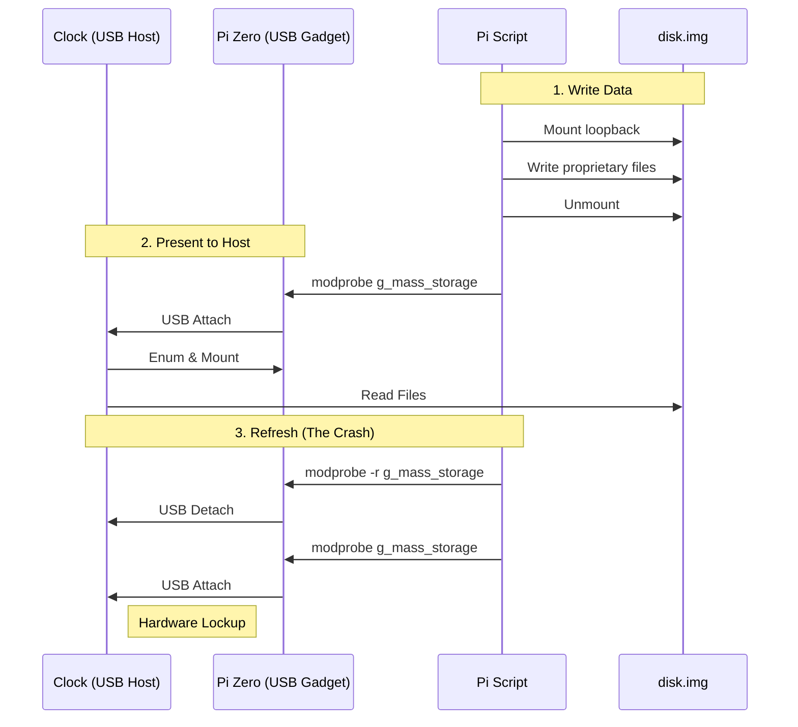

## 1. Introduction: The Target

I picked up this cheap LED matrix clock on an auction site for about $15. On the surface, it’s a standard, bright
7-segment clock with some mono led matrices (70x14 and 21x14) hybrid display. But the software ecosystem driving it was
an absolute nightmare.

To get this thing to display custom text or animations, you had to use a proprietary, incredibly buggy piece of Chinese
software (called `smc_tp_software`, Windows-only app, looking like something from 90's). You would generate your layout
in the app, export a proprietary file to a physical USB flash drive, walk over to the clock, plug it in, and wait for it
to flash its internal memory.

It was slow, static, and completely useless for my goal: a dynamic, unattended display for Home Assistant alerts.

### The First Attempt: The "Smart" USB Drive

My initial thought was to avoid using the USB stick and just trick the clock with something more controllable.

I've generated 2 example layouts with the app and I wired up a Raspberry Pi Zero configured as a USB Mass Storage
Gadget. The idea was simple: write a script on the Pi to switch the proprietary files on the fly, mount the virtual
drive to the clock, and force an update. Here is the simplified diagram of how it should work:

It failed miserably. The clock's firmware was incredibly fragile. Every time the Pi Zero simulated a USB attach/detach
event to refresh the file system, the clock’s board would reset or behave in erratic way. The hardware just couldn't
handle the unstable USB enumeration. It was time to abandon the obvious approach.

## 2. The Brains of the Operation

If I couldn't trick the software, I had to replace it. I cracked the case open to inspect the internals, expecting a
wasteland of black epoxy blobs.

I was pleasantly surprised. Under the hood, the board looked almost DIY-friendly. There was zero hardware obfuscation.
The main microcontroller was even sitting on its own separate daughterboard using standard pin headers.

The brain of the operation was an STM32F105RB (Connectivity Line). More importantly, the manufacturer had generously
exposed the UART pins right on the board.

Since I knew the original desktop app had a "UART mode" tucked away in its settings, I hooked up a standard USB-to-UART
bridge.

It worked. The app could push updates directly over serial. It wasn't quick though (tens of seconds for updating single
text), so updating the content would take too long for a notification system.

My next logical step was to fire up a logic analyzer or Wireshark with a serial plugin to sniff the protocol. However, I
quickly hit a wall: the protocol wasn't just sending ASCII text; it was sending pre-rendered, complex data payloads that
the proprietary app generated. Reverse engineering the payload structure just to send a string of text wasn't worth the
headache. Especially, that the update was taking ages to perform.

At that point, I made the call: **we're going all in**. I was going to wipe the factory firmware, write my own from
scratch, and turn this clock into a first-class Home Assistant endpoint with wireless connectivity and learn something
in the way.

## 3. The MekOps Objective

Why go through all this trouble for a $15 clock?

First, for the sheer sake of learning and exploration. There is something deeply satisfying about taking a cheap,
practically useless piece of e-waste and re-architecting it into a genuinely smart device.

Second, this fits perfectly into the MekOps (Microservices, Embedded, and Kernels Operations) philosophy. We are taking
raw embedded hardware, decoupling it from its terrible vendor lock-in, and turning it into a physical sink (launching
Project TELEGRAPH - more details - soon) that can be orchestrated by a modern edge pipeline.

But to write custom firmware, we have to figure out how this STM32 is actually talking to the LED drivers. And because I
refuse to sit tethered to a desk with a USB cable for days while probing pins, we are going to reverse engineer this in
a unorthodox way.
