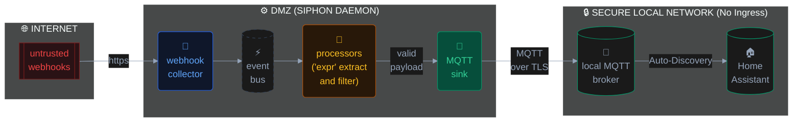

The traditional "secure" answer is to use Tailscale or WireGuard. That works great for you, the admin, but you can't
install a Tailscale client on a closed-ecosystem third-party API.

We need a DMZ. We need a hardened, isolated "virtual device" exposed to the internet that can catch external webhooks,
ruthlessly validate them, strip out the garbage, and push only the sanitized data into Home Assistant.

That will be **Siphon**. Currently it is a lightweight Go daemon that acts as simple pipeline for sensor data, but I
plan to extend it to act as public-facing gateway, completely airgapping Home Assistant from the public web.

## In the Lab: The Airgapped Ingress Architecture

Siphon is currently undergoing a massive v2 architectural rewrite. I'm building a linear, declarative pipeline based on
a _Directed Acyclic Graph (DAG)_ that is designed specifically to act as a secure ingress point.

Instead of opening port 8123 and letting the world poke at your Home Assistant UI, you expose Siphon's webhook collector
(via a [Cloudflare Tunnel](https://developers.cloudflare.com/cloudflare-one/networks/connectors/cloudflare-tunnel/),
[Tailscale Funnel](https://tailscale.com/docs/features/tailscale-funnel) or some kind of strict Nginx reverse proxy -
there could be some secure options to expose simple webhook to reduce the attack surface).

Here is what the internal data flow looks like for catching a public webhook and safely routing it to the local network:

When this pipeline is running, data flows left-to-right through an isolated goroutine:

1.  **The Bastion (Webhook Collector):** Siphon exposes a simple HTTP listener. It requires a hardcoded Bearer token. If
    the token is missing or wrong, the connection is instantly dropped. No database lookups, no complex authentication
    flows to exploit.
2.  **The Knife (Processors):** This is where Siphon protects your internal state. Using the embedded `expr` engine, you
    explicitly define which JSON keys are allowed to pass through. If an external service tries to inject a massive 5MB
    payload or malformed arrays, the `filter` processor drops it on the floor.
3.  **The Bridge (MQTT Sink):** Once the data is verified, sanitized, and reformatted, Siphon pushes it securely to your
    local MQTT broker. It will handle the auto-discovery mechanism and expose itself as a "virtual" device to HA, which
    can be added to any automations.

Home Assistant simply subscribes to the local MQTT broker. It never talks to the internet, and the internet never talks
to it. Siphon absorbs all the risk at the edge.

## The Roadmap

While the core memory-bus is actively being re-architected, I'm laying the groundwork for features required to make
this a piece of true infrastructure:

**1. Write-Ahead Log (WAL) for Zero Data Loss** If you're using Siphon to catch important external webhooks (like GPS
location updates), you can't afford to lose them if your internal MQTT broker restarts for an update. We need a durable
persistence engine. If the internal network drops, Siphon spools the incoming public webhooks to disk and fires them off
when the local broker comes back online.

**2. The HA Add-on (The Escape Hatch)** Running this in an isolated Docker container in a DMZ VLAN is the purist way,
but I want it accessible. The plan is to package Siphon as a Home Assistant Add-on. The goal: manage your public gateway
rules from the HA sidebar without SSH.

**3. WebAssembly (Wasm) Plugins** The `expr` engine handles most JSON sanitation, but sometimes you need real logic to
decode/decrypt proprietary binary payloads before they hit MQTT. You will be able to write custom decoders in Rust or
TinyGo, compile them to `.wasm`, and hot-load them into the gateway pipeline.

## The Code

Siphon is open-source and very much a work in progress. If you want to lock down your smart home but still need a way to
pipe external data into your ecosystem, check out the repository and feel free to fork and hopefully open a PR!



> Project page is [available here](/projects/siphon)
