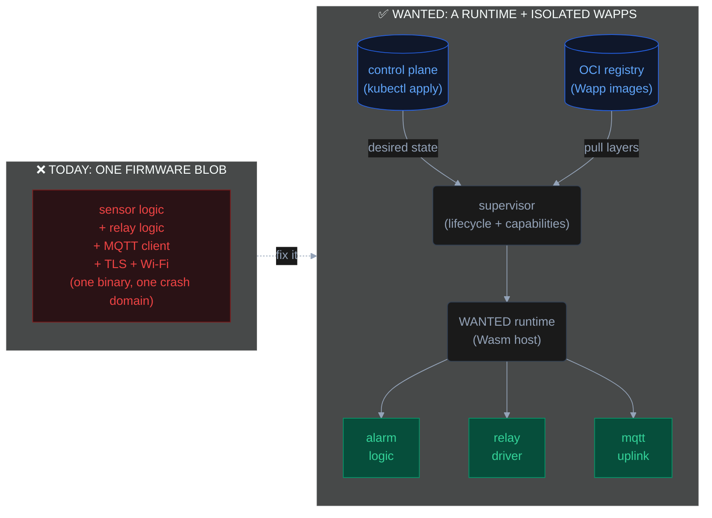

Containers, namespaces, capability dropping, rolling deploys — the whole point was to stop shipping one fragile blob.
And yet that is precisely what we're running on every ESP32 in house. The custom Arduino sketch driving your garage
door, the ESPHome node reading three sensors, the Tasmota plug — each one is a single firmware image where every line of
logic shares one address space, one privilege level, and one update unit. We stopped calling that acceptable on servers
years ago. On microcontrollers we never started.

## The fragility proof

The defining property of a monolith is that a failure anywhere is a failure everywhere. Embedded firmware is the purest
monolith left in common use. Each one is tailored to its job — shaped by the SDK, BSP, and RTOS it was built on —
mixing business logic with hardware glue.

A null-pointer dereference in your I²C temperature driver doesn't degrade the temperature reading — it panics the whole
chip, taking your door sensor, your relay logic, and your MQTT uplink down with it. There is no process boundary to
contain the blast. There is no process at all.

It gets worse when the bug isn't yours. Your firmware statically links an MQTT client, a TLS stack, a JSON parser, a
Wi-Fi driver and that useful third-party lib that you've used a single function from. A CVE in *any* of them is a CVE in
your light switch. On a server you'd patch the affected library and roll the deployment. Here, a vulnerability in a
transitive dependency means re-flashing physical hardware — assuming you even find out, assuming the original author
still maintains the project, assuming the fix fits in the same flash budget.

This is the security posture of 2009. One compromised component owns the entire device, and the same device sits on
your home network, exposing everything else.

## Operational friction

Even when nothing is broken, the monolith taxes you on every change.

Want to tweak one automation threshold? Rebuild the full image, cross your fingers on the flash, and pray the device
comes back up. Running ten nodes? That's ten build targets, ten binaries to track, ten reflashes to coordinate — and if
two of them run different chips, two toolchains. There is no notion of "deploy this one piece of logic to these three
devices." The unit of deployment is *the entire firmware*, and the unit of failure is *the entire device*.

Compare that to how you ship everything else: a registry, a versioned artifact, a declarative desired state, and a
control plane that reconciles it. Almost none of that exists in mainstream embedded firmware. Your deployment pipeline
is a rebuild, a USB flasher, and hope, that device is still within cable reach and will not brick itself afterwards.

## The landscape, honestly

The existing tools are good at what they do. Most are still monoliths — and the ones that aren't, trade isolation for
other constraints. Here's how they compare (WANTED is introduced in the next section):

| Dimension | [ESPHome](https://esphome.io) | [Tasmota](https://tasmota.github.io) | [MicroPython](https://micropython.org) | [Toit](https://toit.io) | [Thinger.io](https://thinger.io) | **WANTED** |
|-----------|---------|---------|-------------|------|--------|--------|
| **Isolation** | None — one binary | None — one binary | None — one shared VM, shared globals | Per-app VM process, private heap | None — thin SDK library in monolithic firmware | Per-app Wasm linear-memory sandbox |
| **Security model** | No sandboxing; OTA password auth only | No sandboxing; OTA password auth only | No sandbox; scripts access all interpreter APIs | Process separation; platform controls deployment | TLS device tokens; no runtime sandboxing | WASI capability model; deny-by-default hardware access; VFS grants per Wapp; revocable at runtime |
| **Provisioning & signing** | HTTPS OTA; optional firmware signature (ECDSA); API key / MQTT password | HTTPS OTA; no firmware signing; MQTT credentials | No platform-level signing or device auth | Managed by Toit cloud; proprietary device registration | Cloud-managed device credentials; TLS; self-hostable backend | Ed25519-signed desired state; cross-device replay prevention; TLS transport; Wapp binary signing; optional ATECC608 HW key storage; supervisor is sole trust anchor — Wapps never see credentials |
| **Device management** | Per-device web UI; Home Assistant integration; no fleet view | Per-device web UI; TasmoAdmin for basic fleet; no declarative management | None — manual per-device access | Full fleet management via Toit cloud (proprietary); device registry, OTA, monitoring | Core feature — device registry, real-time dashboards, remote control, data storage; self-hostable | Declarative fleet management via K8s operator or standalone binary; drift detection and auto-reconciliation; device digital twin |
| **Connectivity** | WiFi / Ethernet assumed | WiFi / Ethernet assumed | WiFi / Ethernet assumed | WiFi (ESP32 only) | WiFi / Ethernet / cellular (via SDK) | WiFi, Zigbee, Thread and more; protocol also supports constrained links (LoRa, NB-IoT) — offline-first reconciliation works over any transport |
| **OTA granularity** | Full firmware reflash | Full firmware reflash | File-level for scripts; reflash for native | Per-app container update | Full firmware reflash | Per-app delta layer |
| **Portability** | Recompile per board | Per-chip prebuilt binary | Per-port firmware build | ESP32 only; proprietary Toit bytecode | Multi-platform client library; recompile per arch | Compile once (`wasm32-wasi`), run on any arch |
| **Platform layer** | Framework on ESP-IDF / FreeRTOS | Framework on Arduino / ESP-IDF | Port-specific (bare-metal or FreeRTOS) | Custom VM + scheduler | Cloud connectivity SDK; sits on top of existing firmware stack | Runtime on RTOS; targets NuttX (POSIX); HW support inherits from underlying OS |
| **HW peripherals** | 300+ pre-built component integrations (sensors, displays, LED strips, relays) | Extensive smart-plug and energy-monitoring integrations; Zigbee bridge support | Raw hardware API; bring your own drivers | ESP32 peripherals via community packages | No abstraction — uses whatever the underlying firmware exposes | Native 9P protocol — peripherals are files; a remote BLE adapter or I2C bridge appears as a `/dev` entry; hardware boundaries are not physical |
| **Language** | YAML → generated C++ | C/C++ (config-driven) | Python (subset) | Toit language only (proprietary) | C++ SDK; REST API for Linux targets | Anything targeting `wasm32-wasi` — C, Rust, Zig, Go, TS |
| **License** | MIT | GPL-3.0 | MIT | LGPL (VM + Artemis) | Apache 2.0; self-hostable | Apache 2.0 |

Toit gets closest — per-container isolation means one crashing app leaves the others running, and you can deploy an app
update without touching the firmware. The constraint is the bytecode: Toit's VM uses a proprietary format only the Toit
compiler can target, which locks you into one language and one platform. [WebAssembly](https://webassembly.org/) is an
open W3C standard — any language with an LLVM backend can compile to it, and any architecture with a Wasm host can run
it. That single design choice is why WANTED's language and portability rows look the way they do.

MicroPython earns a mention because you can push a `.py` file without reflashing the C firmware — but every script
still runs in one shared interpreter with a shared global namespace. One runaway script, one unhandled exception, and
the others go with it. There is no sandbox, no per-app capability boundary, and the moment you need a native module
you are back to building and flashing firmware.

Most of these were not designed around isolation, because isolation on a microcontroller was assumed to be a luxury you
couldn't afford. That assumption is not necessarily true anymore.

## The thesis

Here is the inversion that the rest of this series is about:

**What if the firmware were just a runtime?**

Not the application. Not the business logic. Just a thin, hardened host whose only job is to safely run code it was
handed — sandboxed, isolated, versioned, and individually replaceable. All the actual logic — the alarm state machine,
the sensor driver, the display formatter — becomes a separate, sandboxed application that the runtime loads, isolates,
provides inter-app and external communication and can hot-swap without touching anything else on the device.

That is not a new idea. It is the idea behind every container platform you already run. The only reason it hasn't
reached the microcontroller is that nobody built the runtime small enough — until the right primitive showed up.

The primitive is _WebAssembly_. It was built to run untrusted code safely inside a browser tab:
architecture-independent bytecode, memory-safe by construction, no shared address space, explicit capability-gated
access to the outside world. Every one of those properties is exactly what a multi-tenant microcontroller needs. We just
have to point it at bare metal instead of a browser.

## Enter WANTED

That is what **WANTED** — _WebAssembly Nanocontainer Technology for Embedded Devices_ — is: an open-source runtime
that turns a microcontroller into a proper compute node, running isolated, individually deployable applications
("_Wapps_"), delivered and reconciled from a cloud-native control plane using the tooling you probably already know.

**WANTED** is a general-purpose cloud-native framework for embedded devices — IoT, industrial control, edge compute.
Smart home is where this series starts, not where **WANTED** ends: it is a target-rich environment for the exact
problems **WANTED** solves, the hardware is cheap and accessible, and the legacy deployment story is universally
painful. Every lesson learned here applies directly to an industrial sensor network or a fleet of edge controllers.
Unlike most tools in this space, the control-plane protocol does not assume a reliable high-bandwidth uplink — it is
designed with Delay-Tolerant Networking (_DTN_) in mind, operating correctly over _LoRa_, _NB-IoT_, and other
constrained or intermittent links, making it viable for field deployments where WiFi is not an option.

The current release targets the ESP32-S3 (Xtensa architecture) — a cheap, widely available chip — running
[NuttX RTOS](https://nuttx.apache.org/). The architecture is deliberately platform-neutral: `wasm32-wasi` bytecode, the VFS capability
model, and the control-plane protocol carry no hardware assumptions. The next concrete hardware target is an
RP2350-based board (ARM Cortex-M33) — a different architecture entirely, same Wapp binary, no recompile. RISC-V and
further NuttX-hosted targets follow — and the same Wapp binary that runs on a microcontroller is intended to run even
on a much bigger machine — with or without a general-purpose OS in between.

The model is three layers — a **runtime** on the device, a **supervisor** that manages the apps' lifecycle locally, and
a **cloud control plane** that pushes desired state down to the fleet:

Each Wapp lives in its own Wasm sandbox. A crash in the alarm logic cannot touch the relay driver. A CVE in the uplink's
TLS stack is patched by shipping one new layer to one app — no reflash, no downtime for the rest. And the alarm logic
_cannot_ drive a relay unless the supervisor explicitly granted it that capability, because hardware access itself is
mediated, not compiled in. Because every Wapp's state is fully contained within a bounded, isolated memory region, the
runtime always knows exactly what that Wapp _is_ at any point in time — not just what it is doing. That property has
implications well beyond fault isolation.

That last point — hardware as a capability-gated namespace rather than a direct register poke — is the part that makes
the isolation real instead of cosmetic.

From a developer's perspective, writing a Wapp feels like writing for any POSIX-compliant OS. Hardware peripherals are
files: you `open("/dev/i2c0")`, `read()` sensor bytes, `write()` to a GPIO pin. No vendor HAL, no register maps, no
BSP glue — just standard file descriptors that the runtime hands your app based on what the supervisor granted. And
it is not only hardware that lives in that namespace. The same code that drives a sensor on a physical device
compiles and runs unchanged on your development machine. That is not a side effect; it is a design requirement.

## What's next

The first public release of WANTED is **coming soon**.
> UPDATE (2026-06-15): [Wanted is public!](projects/wanted)

This is the opening of a series that builds the full stack from the bytecode up. Over the coming posts:

- **WebAssembly on bare metal** — why a browser security primitive is the right runtime for a microcontroller, and what
  a Wapp actually _is_.
- **Hardware as files** — the Plan 9-inspired capability model that gates GPIO, I2C, and sockets behind an auditable
  namespace.
- **OCI images on a microcontroller** — packaging and delivering Wapps as layered, delta-updatable images stored in any
  Docker-compatible registry.
- **The control plane** — instead of tracking which firmware version is running on which device and updating them one by
  one, you declare the desired state ("I want version 1.3 of this Wapp running on all nodes in building B") and the
  system converges to it automatically — detecting drift, retrying failures, and reporting back. Part of the WANTED
  ecosystem will be an Kubernetes operator that exposes embedded devices as first-class resources, so the same GitOps
  pipeline that deploys your backend services can also manage those devices. For everyone else, a standalone CLI tool
  will be provided with the same guarantees and without requiring a k8s cluster.
- **Real deployments** — nodes running in my house right now.
- **Checkpoint/Restore** — live-migrating a running process between devices.

The firmware monolith was a reasonable compromise when the hardware couldn't do better. The hardware can do better now.
Let's stop shipping blobs.
