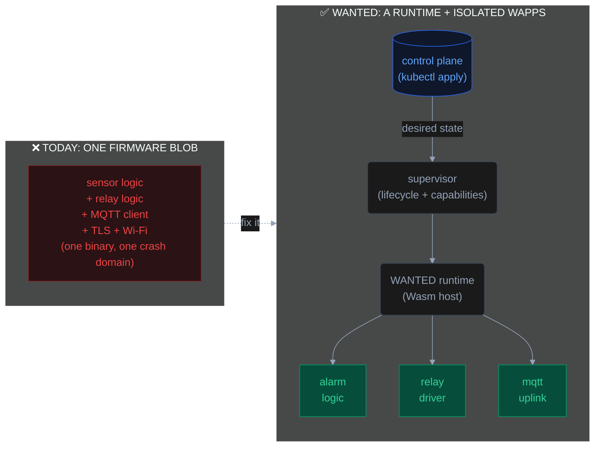

You wouldn't deploy your entire microservices backend as a single statically-linked binary, running as root, on an
unpatched server, with no way to update one service without rebuilding all of them. You spent the last decade
specifically *not* doing that. Containers, namespaces, capability dropping, rolling deploys — the whole point was to
stop shipping one fragile blob.

And yet that is precisely what you are running on every ESP32 in your house.

The custom Arduino sketch driving your garage door, the ESPHome node reading three sensors, the Tasmota plug — each one
is a single firmware image where every line of logic shares one address space, one privilege level, and one update unit.
We stopped calling that acceptable on servers years ago. On microcontrollers we never started.

## The fragility proof

The defining property of a monolith is that a failure anywhere is a failure everywhere. Embedded firmware is the purest
monolith left in common use.

A null-pointer dereference in your I2C temperature driver doesn't degrade the temperature reading — it panics the whole
chip, taking your door sensor, your relay logic, and your MQTT uplink down with it. There is no process boundary to
contain the blast. There is no process at all.

It gets worse when the bug isn't yours. Your firmware statically links an MQTT client, a TLS stack, a JSON parser, and a
Wi-Fi driver. A CVE in *any* of them is a CVE in your light switch. On a server you'd patch the affected library and
roll the deployment. Here, a vulnerability in a transitive dependency means re-flashing physical hardware — assuming you
even find out, assuming the original author still maintains the project, assuming the fix fits in the same flash budget.

This is the security posture of 2009. One compromised component owns the entire device, and the entire device sits on
your home network.

## Operational friction

Even when nothing is broken, the monolith taxes you on every change.

Want to tweak one automation threshold? Rebuild the full image, cross your fingers on the flash, and pray the device
comes back up. Running ten nodes? That's ten build targets, ten binaries to track, ten reflashes to coordinate — and if
two of them run different chips, two toolchains. There is no notion of "deploy this one piece of logic to these three
devices." The unit of deployment is *the entire firmware*, and the unit of failure is *the entire device*.

Compare that to how you ship everything else: a registry, a versioned artifact, a declarative desired state, and a
control plane that reconciles it. None of that exists in mainstream embedded firmware. You are SSH-ing into prod and
recompiling, except prod is glued to your wall.

## The landscape, honestly

The existing tools are good at what they do. They are still monoliths. Here is the architecture, not the marketing:

| Dimension | ESPHome | Tasmota | MicroPython | WANTED |
|-----------|---------|---------|-------------|--------|
| **Isolation** | None — one binary | None — one binary | None — one shared VM, shared globals | Per-app Wasm linear-memory sandbox |
| **Portability** | Recompile per board | Per-chip prebuilt binary | Per-port firmware build | Compile once (`wasm32-wasi`), run on any arch |
| **OTA granularity** | Full firmware reflash | Full firmware reflash | File-level for scripts; reflash for native | Per-app delta layer |
| **Language** | YAML → generated C++ | C/C++ (config-driven) | Python (subset) | Anything targeting `wasm32-wasi` — C, Rust, Zig, Go, TS |

MicroPython gets closest to the right idea — you can push a `.py` file without reflashing the C firmware — but every
script still runs in one shared interpreter with a shared global namespace. One runaway script, one unhandled
exception, and the others go with it. There is no sandbox, no per-app capability boundary, and the moment you need a
native module you are back to building and flashing firmware.

None of these were designed around isolation, because isolation on a 240 MHz chip with a few hundred kilobytes of RAM
was assumed to be a luxury you couldn't afford. That assumption is now wrong.

## The thesis

Here is the inversion that the rest of this series is about:

**What if the firmware were just a runtime?**

Not the application. Not the business logic. Just a thin, hardened host whose only job is to safely run code it was
handed — sandboxed, isolated, versioned, and individually replaceable. All the actual logic — the alarm state machine,
the sensor driver, the display formatter — becomes a separate, sandboxed application that the runtime loads, isolates,
and can hot-swap without touching anything else on the device.

That is not a new idea. It is the idea behind every container platform you already run. The only reason it hasn't
reached the microcontroller is that nobody built the runtime small enough — until the right primitive showed up.

The primitive is WebAssembly. It was built to run untrusted code safely inside a browser tab: architecture-independent
bytecode, memory-safe by construction, no shared address space, explicit capability-gated access to the outside world.
Every one of those properties is exactly what a multi-tenant microcontroller needs. We just have to point it at bare
metal instead of a browser.

## Enter WANTED

That is what **WANTED** — *WebAssembly Nanocontainer Technology for Embedded Devices* — is: a runtime that turns a
$4 microcontroller into a proper compute node, running isolated, individually deployable applications ("Wapps"),
delivered and reconciled from a cloud-native control plane using the tooling you already know.

The model is three layers — a **runtime** on the device, a **supervisor** that manages the apps' lifecycle locally, and
a **cloud control plane** that pushes desired state down to the fleet:

Each Wapp lives in its own Wasm sandbox. A crash in the alarm logic cannot touch the relay driver. A CVE in the uplink's
TLS stack is patched by shipping one new layer to one app — no reflash, no downtime for the rest. And the alarm logic
*cannot* drive a relay unless the supervisor explicitly granted it that capability, because hardware access itself is
mediated, not compiled in.

That last point — hardware as a capability-gated namespace rather than a direct register poke — is the part that makes
the isolation real instead of cosmetic. It's also too big for this post.

## What's next

This is the opening of a series that builds the full stack from the bytecode up. Over the coming posts:

- **WebAssembly on bare metal** — why a browser security primitive is the right runtime for a microcontroller, and what
  a Wapp actually *is*.
- **Hardware as files** — the Plan 9-inspired capability model that gates GPIO, I2C, and sockets behind an auditable
  namespace.
- **OCI images on an ESP32** — packaging and delivering Wapps as layered, delta-updatable images.
- **The control plane** — from `kubectl apply` to a running process on bare metal.
- **Real deployments** — two production nodes running in my house right now.
- **Checkpoint/Restore** — live-migrating a running process between devices.

The firmware monolith was a reasonable compromise when the hardware couldn't do better. The hardware can do better now.
Let's stop shipping blobs.

*Next in the series: WebAssembly on Bare Metal — the runtime primitive that changes everything.*
