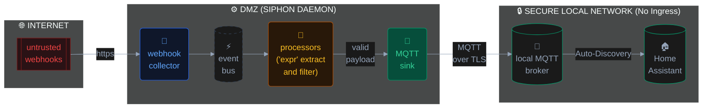

Siphon v0.5 utilizes a decoupled, stateful Event Bus architecture. The data flow operates in a strict, linear pipeline designed to isolate data ingestion from state management and routing.

### The Data Lifecycle

1. **Collectors (The Ingress):** Actively subscribe to or poll configured sources. Their only job is to acquire raw bytes and push them onto the internal Event Bus with a logical alias. Supported engines: `mqtt`, `rest`, `webhook`, `file`, `shell`, and the native `hass` Supervisor API.
2. **Parsers (The Sandbox):** Pipelines subscribe to aliases on the Event Bus. They use integrated parser engines (`jsonpath`, `regex`) to extract structured data from raw payloads and safely cache the exact state in memory.
3. **Dispatchers (The Schedulers):** Determine *when* data should be pushed.
   * **Cron:** Uses standard cron syntax to wake up, pull the latest cached states from multiple pipelines, and dispatch them simultaneously.
   * **Event:** Triggers immediately upon a value change or threshold breach.
4. **Sinks (The Egress):** Format the state using the embedded `expr` evaluation engine and transmit to final destinations. Supported sinks: `hass` (MQTT Auto-Discovery — stateful entities via `sensor`, `binary_sensor` and stateless event triggers via `device_automation`), `mqtt`, `gotify`, `ntfy`, `windy`, `iotplotter`, `stdout`.

### Zone Isolation Model

