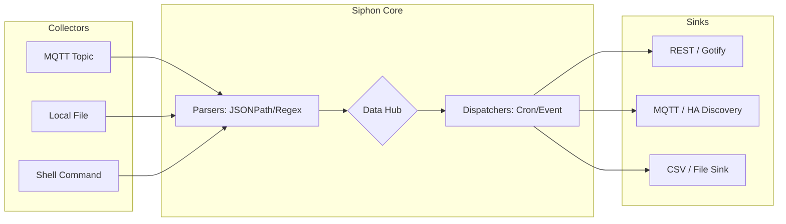




**Siphon** is a lightweight, dynamically configurable data aggregation engine written in Go. Designed for edge computing
and containerized deployments, Siphon acts as an intelligent middleware layer. It gathers raw telemetry data from
diverse sources (such as MQTT brokers, local files, and shell command outputs), normalizes it, and dispatches it to
various sinks (REST APIs, notification services, or local files) based on temporal or event-driven rules.

## Architectural Overview

Siphon utilizes a decoupled, hub-and-spoke architecture centered around an in-memory _Data Hub_. The data flow is broken
down into five distinct phases:

1. **Collectors (The Inputs):** Actively subscribe to or poll configured sources. Current implementations include `mqtt`
   (subscribes to topics), `file` (reads file contents), and `shell` (executes OS commands).
2. **Parsers (The Normalizers):** Convert raw, unstructured data from the Collectors into intermediate key-value pairs.
   Supported engines include `jsonpath` for structured JSON and `regex` for raw text extraction.
3. **Data Hub:** The central state manager holding the parsed data between ingestion and dispatch.
4. **Dispatchers (The Schedulers):** Determine _when_ data should be pushed to the destinations.
   * **Cron:** Uses standard cron syntax (down to the second) to schedule batch dispatches.
   * **Event:** Triggers immediately upon a value change, threshold breach, or a specified timeout (e.g., alerting when
     a sensor goes offline).
5. **Sinks (The Outputs):** Format and transmit the scheduled data to its final destination. Sinks range from simple
   `stdout` and CSV files to external REST services like Gotify, Windy, and IOTPlotter.

Architecture diagram:



## Key Features

* **Expression Evaluation:** Siphon integrates the powerful [expr](https://expr.medv.io/) engine. This allows you to
  perform real-time math on incoming variables (e.g., converting Celsius to Fahrenheit inline) and dynamically generate
  complex JSON payloads for your sinks.
* **Environment Variable Substitution:** Securely inject secrets (like API keys) or environment-specific variables into
  your YAML configuration using the `%%ENV_VARIABLE%%` syntax.
* **Extensible Module System:** Adding a new integration is entirely self-contained. Developers can easily write a new
  Collector or Sink in Go and register it in `internal/modules/modules.go` without altering the core engine.
* **Cloud-Native Builds:** Siphon is built using `ko`, providing minimal, secure, multi-architecture (x86/ARM) Docker
  containers out of the box.

## Configuration Example

Siphon is entirely driven by a declarative YAML configuration. The following v1 schema demonstrates how to
simultaneously pull weather data from MQTT, read local CPU temperatures, and monitor disk space via shell commands,
dispatching the results via both Cron schedules and Event triggers.

```yaml
version: 1

collectors:
  mqtt:
    type: mqtt
    params:
      url: ssl://mqtt:8883
      user: user
      pass: pass
  mqtt-2:
    type: mqtt
    params:
      url: ssl://mqtt2:8883
  cpuTemp:
    type: file
    params:
      interval: 5
  cmd:
    type: shell
    params:
      interval: 5

sinks:
  plotter:
    type: iotplotter
    params:
      url: http://iotplotter.com
      apikey: %%IOT_API_KEY%% # Environment variable expansion
      feed: "123456789"
  gotify:
    type: gotify
    params:
      url: https://gotify
      token: ABCDEFG
  windy:
    type: windy
    params:
      apikey: abcdefg
      id: 1
  stdout:
    type: stdout

data:
  outside:
    collector: mqtt
    path: /topic1
    parser: jsonpath
    vars:
      temp: "$.temp"
      humi: "$.humi"
    conv:
      temp: "*10" # Expression evaluation to convert values
  cnt:
    collector: mqtt-2
    path: /topic/2
    parser: jsonpath
    vars:
      cnt: "$"
  cpu:
    collector: cpuTemp
    path: /sys/class/thermal/thermal_zone0/temp
    parser: regex
    vars:
      temp: "[0-9]*"
    conv:
      temp: float(temp) / 1000
  free:
    collector: cmd
    path: "df -BM | grep -E '/$' | awk '{print $4}'"
    parser: regex
    vars:
      space: "[0-9]*"
    conv:
      space: float(space) / 1024

dispatchers:
# 1. Cron Dispatcher: Fires every 30 seconds
- type: cron
  param: "*/30 * * * * *"
  sinks:
  - name: stdout
    type: expr # Generates a JSON string using the state from the Data Hub
    spec: |
      {
        "data": {
          "temp": [ {"value": outside?.temp ?? 0} ],
          "humi": [ {"value": outside?.humi ?? 0} ]
        }
      }
  - name: stdout
    type: template # Standard Go templating
    spec: |
      Cnt: {{ .cnt.cnt }}

# 2. Event Dispatcher: Fires when 'outside' timestamp changes, or times out after 60s
- type: event
  param:
    trigger: outside
    var: timestamp
    expr: new != old
    timeout: 60
  sinks:
  - name: stdout
    type: template
    spec: |
      EVENT: {{ if IsTimeout }}no update! {{ else }} new outside measurement! {{ end }}
  - name: stdout
    type: expr
    spec: |
      IsTimeout() ? "timeout" : "ok"
```

## Deployment

Siphon is designed to be deployed as a containerized service. Mount your configuration file into the container to start
processing data immediately.

```yaml
version: '2'

volumes:
  config:

services:
  siphon:
    image: ghcr.io/mekops-labs/siphon:latest
    command:
    - /config/config.yaml
    volumes:
    - config:/config
    restart: always
```

## Roadmap

The project is still WIP. My current direction is to make it a viable Home Assistant extension with support for MQTT
auto discovery, then I plan to polish the project.

### Phase 1: Core Engine Refactor (V2 Architecture)

**Focus: Implementing the Hybrid Event Bus and the new linear pipeline configuration.**

- ☐ Config V2 Schema: Define config.go structs to parse the new pipelines array and generic parameters.
- ☐ Hybrid Bus Engine: Build HybridBus supporting both ModeVolatile (ring buffers) and ModeDurable (WAL).
- ☐ Modules Refactor: Update all existing Collectors to publish to the HybridBus and handle backend delivery failures.
- ☐ Sink Refactor: Update all existing Sinks to subscribe to the HybridBus and explicitly call event.Ack() upon success.

### Phase 2: Home Assistant Native Ecosystem

**Focus: Seamless integration, auto-discovery, and providing a premium Add-on experience.**

- ☐ HA Config Structs: Define DiscoveryConfig and map YAML fields for HA metadata (Device Class, Node ID, etc.).
- ☐ HA MQTT Payloads: Implement JSON-tagged DiscoveryPayload and DevicePayload structs.
- ☐ MQTT Reliability: Implement Last Will and Testament (LWT) logic in the MQTT Sink.
- ☐ Auto-Discovery Hooks: Create Announce() method to publish retained discovery configs upon MQTT connection.
- ☐ Add-on Repository: Create the standalone HA Add-on structure.
- ☐ Ingress Web Server: Implement an embedded Go web server in pkg/editor.
- ☐ Embedded UI: Create an index.html using Ace.js for live config.yaml editing via HA Ingress.

### Phase 3: API Gateway & Synchronous Processing

**Focus: Transforming Siphon into a two-way sync engine for devices like wearables.**

- ☐ Reply Channels: Add a ReplyTo channel to the Event struct to support synchronous routing.
- ☐ Webserver Collector: Implement a Collector that keeps HTTP requests open while waiting for the pipeline to finish.
- ☐ Responder Sink: Implement a Sink that formats pipeline output and writes it back to the ReplyTo channel.

### Phase 4: Benchmarking & Performance

**Focus: Proving reliability and measuring tail latency under extreme load.**

- ☐ Harness Setup: Create an E2E testing harness (cmd/bench/main.go) utilizing a local MQTT broker.
- ☐ Precision Metrics: Integrate hdrhistogram-go for microsecond-precision latency and jitter tracking.

### Phase 5: Advanced Extensibility & Polish

**Focus: Documentation, tooling, and future-proofing the parser engine.**

- ☐ JSON Schema: Generate a complete JSON Schema for config.yaml (v2).
- ☐ Wasm: WebAssembly processors support (plugin system), TBD.
